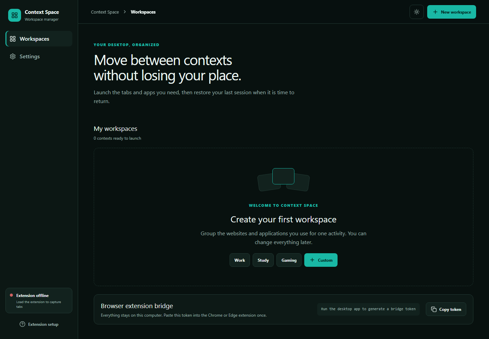

# Context Space

Context Space 是 Windows 專用、local-first 的桌面工作區管理器。它把瀏覽器分頁、桌面應用程式與離開工作區時的處理方式組合成可重複使用的 Workspace，核心流程是：**保存情境 → 切換情境 → 還原情境**。



## 解決的問題

工作、課業、遊戲與個人活動往往需要完全不同的分頁和程式。人工重建環境很慢，直接關閉程式又可能遺失未保存內容。Context Space 以安全、可預測的方式保存瀏覽器 session、重用已開啟資源，並預設只最小化應用程式。

## 主要功能

- 建立、重新命名、刪除、排序 Workspace，設定圖示與強調色。
- 管理 pinned／saved URL 與 Windows 應用程式。
- 每個 Workspace 各自設定瀏覽器與應用程式離開行為。
- 保存並還原 Last Session，避免重複開啟相同 URL。
- 啟動已設定的程式；若相同 process 已執行則不重複啟動。
- 最小化程式或送出 graceful close；永不強制終止 process。
- Windows system tray 顯示目前 Workspace、快速切換、開啟 Dashboard 或退出。
- Chrome／Edge Manifest V3 擴充功能可加入目前分頁、選取多個分頁並執行開啟／關閉命令。
- 深色與淺色主題、鍵盤焦點、reduced-motion 支援。

## MVP V1 範圍

V1 專注於 Windows、Chrome 與 Edge。無帳號、雲端同步、分析、遙測或 AI。全域快捷鍵、視窗位置還原、跨螢幕 layout 與 scheduling 留在後續版本。

## 技術架構

- Desktop：Tauri 2、Rust、React 19、TypeScript、Vite、Tailwind CSS、Radix Dialog、GSAP。
- Storage：`rusqlite` + bundled SQLite，資料位於 Tauri app data directory。
- Windows integration：Rust + Win32 window API 與 `sysinfo` process discovery。
- Browser extension：Manifest V3、TypeScript service worker、`chrome.tabs`、`chrome.storage`、`chrome.alarms`。
- Bridge：只監聽 `127.0.0.1:47651` 的 HTTP bridge，所有請求需帶本機產生的 token。

更多細節請參閱 [docs/architecture.md](docs/architecture.md)。

## Desktop App 與 Browser Extension 溝通

Desktop 啟動本機 HTTP bridge。擴充功能以使用者從 Dashboard 複製的 token 驗證，輪詢短命令：capture tabs、open URLs、close URLs。資料不離開本機；沒有外部伺服器。

## 環境需求

- Windows 10 1803+ 或 Windows 11（含 WebView2）。
- Node.js 20+ 與 npm。
- Rust stable MSVC toolchain。
- Visual Studio 2022 Build Tools，安裝「Desktop development with C++」。

## 安裝相依套件

```powershell
npm run install:all
```

## 開發模式

```powershell
npm run dev
```

## 測試、Lint 與 Build

```powershell
npm run lint
npm test
npm run build
```

Windows installer 產物位於 `apps/desktop/src-tauri/target/release/bundle/nsis/`。

## 安裝 Chrome Extension

1. 執行 `npm --prefix apps/extension run build`。
2. 開啟 `chrome://extensions` 並啟用 Developer mode。
3. 選擇 Load unpacked，指向 `apps/extension/dist`。
4. 啟動 Context Space desktop app。
5. 從 Dashboard 複製 Bridge token，貼到 extension popup 後按 Connect。

## 安裝 Edge Extension

1. 開啟 `edge://extensions` 並啟用 Developer mode。
2. 選擇 Load unpacked，指向 `apps/extension/dist`。
3. 其餘步驟與 Chrome 相同。

## 使用方式

1. 建立 Work、Homework 或 Games Workspace。
2. 在 Browser 加入網址；勾選 pinned 的網址會在啟動時開啟。
3. 在 Applications 用 Browse 選擇 `.exe`，確認 process name。
4. 設定離開行為。預設會保存 session、關閉 Workspace URL 並最小化程式。
5. 按 Open workspace 切換；回到 Workspace 時可自動或手動 Restore Last Session。
6. 關閉主視窗只會隱藏到 tray；從 tray 選 Quit 才會完全退出。

## 隱私與安全

- 所有 Workspace、URL 與 session 都保存在本機 SQLite。
- 不含帳號、分析、遙測、廣告或雲端同步。
- Bridge 只接受 loopback 連線並要求隨機 token。
- 只支援 HTTP／HTTPS URL；extension 沒有讀取 browser history 的權限。
- Safely Close 使用 `WM_CLOSE`，讓應用程式自行顯示未保存內容提示；不提供 force kill。

## 資料庫

主要資料表為 `workspaces`、`browser_resources`、`app_resources`、`workspace_sessions`、`session_tabs` 與 `app_state`。Foreign key 使用 cascade delete；SQLite 由應用程式啟動時自動 migration／建立。

## Repository Structure

```text
apps/desktop/       React + Tauri Windows app
apps/extension/     Chrome / Edge MV3 extension
design-system/      UI UX Pro Max 設計系統
docs/               架構文件
PROJECT_PLAN.md     產品與工程計畫
FUTURE_ROADMAP.md   後續版本規劃
```

## Troubleshooting

- **Extension offline**：確認 Desktop 正在執行、token 完全一致，且 `127.0.0.1:47651` 未被其他程式占用。
- **Executable missing**：在 Workspace editor 移除舊項目並重新 Browse。
- **程式沒有最小化**：部分 multi-process 或沒有一般 top-level window 的應用程式不接受標準 Win32 動作；Context Space 會顯示 warning，不會強制終止。
- **MSI build 失敗**：本專案預設產生 NSIS installer，不依賴即將淘汰的 VBSCRIPT optional feature。
- **Rust linker error**：確認 Visual Studio Build Tools 已安裝 C++ desktop workload，並重新開啟 terminal。

## Roadmap

詳細內容見 [FUTURE_ROADMAP.md](FUTURE_ROADMAP.md)，包含全域 switcher、Snapshots、Focus Mode、視窗位置／多螢幕還原、更多瀏覽器、自動化、模板、cloud sync 與可選的隱私優先 AI。

## License

MIT
